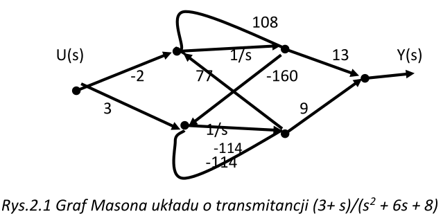

# Wykład 1

## Analiza wielowymiarowego obiektu sterowania w przestrzeni stanu

### Definicja obiektu sterowania

- Obiekt nazywamy obiektem sterowania gdy sterownik/podmiot sterujący oddziaływuje
na dynamikę ewolucji stanu obiektu.
- Skutki tych działań obserwujemy przez sygnały wyjściowe
- Wielowymiarowy obiekt sterowania to taki obiekt który ma wiele wejść,
oraz wiele wyjść.
- Wystarczy że liczba sygnałów sterujących, sygnałów zakłócających bądź sygnałów
wyjściowych będzie większa od 1 aby była mowa o obiekcie wielowymiarowym
- Nazywamy go obiektem MIMO, czyli Multiple Input Multiple Output

### Rodzaje sygnałów wejściowych

Sygnały wejściowe dzielimy na sygnały sterujące oraz sygnały zakłócające.

Sygnały sterujące to takie sygnały, które możemy modulować aby osiągnąc cel sterowania.
Tym celem może być na przykład uzyskanie danego przebiegu zmiennych stanu obiektu

Pozostałe sygnały traktujemy jak sygnały zakłócające. Reprezentują one oddziaływanie
czynników środowiskowych na obiekt sterowania. Nie możemy na przebieg tych
sygnały wpływać, ale zazwyczaj możemy je zmierzyć

### Analiza obiektu sterowania typu MIMO

Analiza obiektów MIMO znacząco różni sie od obiektów SISO poznanych wcześniej.
Wynika to z tego, że trzeba uwzględnić interakcje sygnałów pomiędzy sobą.
Takie interakcje nazywamy również __sprzężeniami skrośnymi w strukturze obiektu__

Ta nazwa będzie mieć więcej sensu później, na razie zapamiętaj że ona się pojawiła

Każdy sygnał sterujący ma potencjał aby wpływał na pozostałe sygnały wyjściowe.
Konsekwencją tego jest to że nie możemy po prostu zwiększyć liczby podproblemów
typu Single Input Single Output. Dobranie regulatora do obiektu MIMO komplikuje
właśnie przez to że sygnały są współzależne od siebie.

## Sporządzanie modeli MIMO w przestrzeni stanu

### Podejście eksperymentalne

Podejście eksperymentalne polega na oddzielnym pobudzaniu sygnałem harmonicznym
(np sinusoidom) o znanej pulsacji wejść obiektu. Celem tego jest wyznaczenie w
stanie ustalonym wzmocnień oraz przesunięć fazowych, a następnie zapisanie
charakterystyk amplitudowo fazowych poszczególnych kanałów przepływu sygnału.

Podejście to sprawdza się tylko w wyjątkowych przypadkach
do sporządzenia modelu wejść-wyjść obiektu.
Taki przypadek następuje gdy badany obiekt jest __stabilnym liniowo
obiektem niskiego rzędu__.

### Przepływ sygnałów w systemach złożonych

Przez kanał rozumiemy scieżkę jaką przeszedł sygnał od danego wejścia
do danego wyjścia obiektu. Tą ścieżkę łatwo sobie zwizualizować na

Taki graf może pomóc nam rozrysować połączenie dowolnie obranego wejścia z 
dowolnie obranym wyjściem. Takie połączenie 
