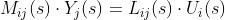

# Tworzenie modelu obiektu wielowymiarowego w przestrzeni stanu cz. 2

## Ustalanie wymiaru wektora stanu na podstawie równań wejścia-wyjścia

$ y^{(n)}(t) + a_{n-1} y^{(n-1)}(t) + ... +   a_{0} y(t) = b_{(m)} u(t) + ... + b_{0} u(t) $

Ponieważ jest to równanie liniowe n-tego rzędu, to jego rozwiązanie wymaga znajomości
n warunków początkowych. Liczba warunków początkowych wyznacza wymiar wektora stanu
i przestrzeni stanu X, czyli dim(X) = n

$ x^{T} = [ x_{1} x_{2} ... x_{n} ] $

Od tej pory równania macierzowe będą odpowiednio podpisane aby się nie myliły

### Definicja zmiennych stanu jako zmiennych fazowych

Przyjmijmy następującą definicje współrzędnych wektora zmiennych stanu x
dla układu o __jednym wejściu__

$ x_{1} = y $
$ x_{2} = y'$
...
$ x_{n} = y^{(n-1)}$

Z powyższej definicji wynika że

$ x_{i+1} = \dot{x_{i}} $

Dla i = <1;n-1>

Dla wielu wyjść powyższe równania możemy zapisać analogicznie

Dla wyjścia 1

$ y_{1} = x_{1} $
$ \dot{y_{1}} = x_{2} $
...
$ y_{1}^{(n_{1}-1)} = x_{n_{1}} $

$ y_{2} = x_{n_{1}+1} $
$ \dot{y_{2}} = x_{n_{1}+2} $
...
$ y_{2}^{(n_{2}-1)} = x_{n_{1}+n_{2}} $

Aż do n_{p}

$ y_{p} = x_{n_{1}+...+n_{p-1} + 1} $
$ \dot{y_{p}} = x_{n_{1}+...+n_{p-1} + 2} $
...
$ y_{n}^{(n_{p}-1)} = x_{n_{1}+...+n_{p}} $

(przyp. tł. Zrozumienie tych równań nie jest krytyczne dla dalszej części,
jednak na wykładzie są one napisane z błędem oraz dziwnym sposobem, gdzie
indeks dolny jest zastępowany kolorem zielonym. )

Rezultatem takiej definicji wektora zmiennych stanu jest to że macierz modelu A
ma postać macierzy Frobeniusa, czyli

$$$
A=\begin{pmatrix}
  0    &   1    &   0    &   0    & \cdots &   0      &   0    \\
  0    &   0    &   1    &   0    & \cdots &   0      &   0    \\
  0    &   0    &   0    &   1    & \cdots &   0      &   0    \\
  0    &   0    &   0    &   0    & \cdots &   0      &   0    \\
\vdots & \vdots & \vdots & \vdots & \ddots & \vdots   & \vdots \\
  0    &   0    &   0    &   0    & \cdots &   0      &   1    \\
 -a_{1}&  -a_{2}&  -a_{3}&  -a_{4}& \cdots & -a_{m-1} & -a_{m}
\end{pmatrix}
$$$

Macierz wejść ma podobną strukturę jednak nie jest to macierz Frobeniusa

$$$
B=\begin{pmatrix}
  b_{1} &   0    &   0    &   0    & \cdots &   0      &   0    \\
  0     &  b_{2} &   0    &   0    & \cdots &   0      &   0    \\
  0     &   0    & b_{3}  &   0    & \cdots &   0      &   0    \\
  0     &   0    &   0    &  b_{4} & \cdots &   0      &   0    \\
\vdots  & \vdots & \vdots & \vdots & \ddots & \vdots   & \vdots \\
  0     &   0    &   0    &   0    & \cdots &  b_{m-1} &   0    \\
  0     &   0    &   0    &   0    & \cdots &   0      &   b_{m}
\end{pmatrix}
$$$

Natomiast macierz wyjść jest wierszowa

$$$
C=\begin{pmatrix}
  0    &   0    &   0    &   0    & \cdots &   0      &   1
\end{pmatrix}
$$$

Układ równań stanu i układ równań wyjścia wielowymiarowego obiektu sterowania o
liniowych właściwościach statycznych i dynamicznych można zapisać w postaci
równań macierzowych

$ \dot{x} = Ax + Bu $
$ y       = Cx + Du $

Te zawiłe równania doprowadziły nas do równań stanu. Przypomnijmy sobie ich nazwy

- A : macierz układu
- B : macierz sterowań
- C : macierz wyjść
- D : macierz transmisyjna

Powrót do transmitancji z równań stanu jest trywialny
charakteryzuje go jeden wzór

$ G(s) = C[s \cdot I - A]^{-1}B + D $

Jednak przejście z transmitancji na równania stanu nie jest już tak jednoznaczne.
Wychodząc od transmitancji można zastosować jedną ze znanych z podstaw
automatyki metod generowania tzw. modeli analogowych
np. bezpośrednią, albo iteracyjną, albo równoległą i na ich podstawie
zdefiniować zmienne stanu, a następnie określić na podstawie schematu poszczególne
elementy macierzy A,B,C,D.
Jednak będą to różne macierze które będą równoważne

Dla układów typu SISO wymienione metody są stosunkowo proste nawet w przypadku
obiektów wysokiego rzędu, które mają złożone, lecz ciągle liniową dynamikę.
W przypadku układów typu MIMO niezbędny jest dodatkowy proces unifikacji
zmiennych stanu, które mogą się powtarzająć się w grafach przepływu sygnałów
poszczególnych kanałów wejścia-wyjścia. Unifikacja jest niezbędna dla usunięcia
redundancji (nadmiaru) w opisie obiektu dynamicznego w przestrzeni stanu, gdyż
zgodnie z definicją, wektor stanu opisujący obiekt dynamiczny musi
mieć rozmiar minimalny.

## Definicja zmiennych fazowych – przypadek obecności zer w transmitancjach kanałów.

Przypomnijmy sobie równanie

Jak widać mamy pochodne po prawej stronie równania, co oznacza że dla pewnych
przebiegów sygnał będzie zerować stan.
Po automatycznemu nazywamy taką sytuacje że mamy "zera" w transmitancji.

### Skąd się te zera wzięły skoro nie było ich w fizycznym obiekcie?

Model wielokanałowy układu MIMO zakłada, że przepływ sygnałów wejściowych do wyjść
odbywa się "do przodu". Rozważany sygnał wejściowy przepływa przez
kolejne połączone szeregowo człony dynamiczne i jego wartość chwilowa jest
modyfikowana.

Człon dynamiczny często charakteryzuje się występowaniem lokalnego
sprzężenia zwrotnego. Niech jego transmitancja w stanie otwartym będzie równa:
G(s) = L(s)/M(s), a bieguny są różne od zer.

W układzie zamkniętym pętlą prostego sprzężenia zwrotnego
$ G(s) = \frac{L(s)}{M(s) + L(s)} $

Położenie biegunów układu zamkniętego ulega modyfikacji, bo równanie charakterystyczne
ma obecnie postać:
$ M(s) + L(s) = 0 $

Współczynniki wielomianu równania charakterystycznego układu zamkniętego zostały
zmodyfikowane od indeksu 0 aż do m :

Dla i = 0, 1, ..., m

$ \dot{a_{i}} = a_{i} + b_{i} $

Wraz z naszą definicją macierzy A oznacza to że mamy oddziaływania wskrośne
pomiędzy kanałami oraz że mamy "wirtualne wymuszenie" zewnętrzne w postaci

$ \dot{u_{i}}(t) = b_{m}u_{i}(t)^{(m)} + b_{m-1}u_{i}(t)^{(m-1)} + ... + b_{0} u_{i}(t) $

Rozumienie takich oddziałowywań jako "wymuszeń wirtualnych" nakłada istotne ograniczenia
na sposób sterowania bo musimy przy naszym planowaniu uwzględniać pochodne sygnału
sterującego.

Warto zauważyć że pomimo tych ograniczeń nie zmieniamy właściwości dynamicznych
rozważanego kanału jak stabilność bo równanie po lewej stronie nie zostało zmienione
Wpływa to jednak na takie cechy jak sterowalność oraz obserwowalność.

Obecność zer również ogranicza nam możliwość skorzystania ze sterowania
cyfrowego/schodkowego. Przez to że pochodne będą nam wzrastać do nieskończoności
przy takim schodku.

Widać, ze nawet, gdy dany kanał nie ma zer, to obecność np. regulatora PID jako lokalnego
stabilizatora urządzenia wprowadzi zera, w dodatku przy nastrajanych nastawach
ze względu na potrzebę stabilizacji obiektu w danym punkcie zera te zmieniają
położenie na płaszczyźnie zespolonej i mogą koincydować (pokrywać się) z
biegunami danego kanału, niekoniecznie związanymi z danym urządzeniem.

### Definicja zmiennych stanu gdy w transmitancji obiektu występują zera

Dla uproszczenia poniższe rozważania będą rozpisane dla jednego kanału
wejścia-wyjścia jednak są one prawdziwe dla wszystkich kanałów.

Należy zmienić definicję zmiennych stanu nieznacznie z formy

$ x_{1} = y $
$ x_{2} = y'$
...
$ x_{n} = y^{n-1}$

Na

$ x_{1} = y - \beta_{0}u $
$ x_{2} = y' - \beta_{1}u$
...
$ x_{n} = y^{(n-1)} - \beta_{n-1}u$

W wyniku powyższej definicji zmiennych fazowych równanie wejścia-wyjścia
zostaje przekształcone do postaci
$ y^{(n)}(t) = \dot{x_{n}}(t) = -a_{1}x_{1}(t) - a_{2}x_{2}(t) + ... + a_{n}x_{n}(t) + \beta_{m}u(t) $

Wówczas współczynniki \beta_{k} wynoszą

$ \beta_{1} = b_{n} $
$ \beta_{2} = b_{n-1} - a_{n-1}b_{0}$
...
$ \beta_{n} = b_{1} - a_{n-1}b_{n-1} - ... - a_{1}b_{1}$

Taki układ ma wtedy postać taką że

- Macierz A ma postać Frobeniusa
- B = [\beta_{2} ... \beta_{n}]^{T}
- C = [0 0 0 0 1]
- D = [\beta_{1}
